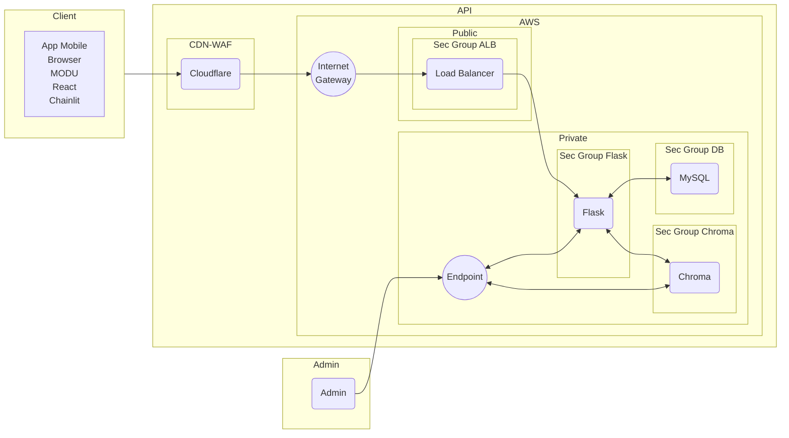

# Assistente - IA

1. Crie um python Virtual Environment
```
python -m venv venv
```
2. Ative o virtual env
```
source bin/activate
```
3. Instale todas as dependencias
```
pip install -r requirements.txt
```
4. Crie um `.env` e cole sua chave de API da OpenAI
```
OPENAI_API_KEY=<api-key>
```
5. Rode o chainlit
```
chainlit run custom.py
```
6. Acesse `localhost:8000`

# Flowchart


# Mindmap
```mermaid
mindmap
    root(("**AI Assistant**
            Decisions"))
        client(Client Side)
            (MODU)
            (Chainlit)
            (React)
            (3rd Party)

        api(**AWS/API**
        Expensive and more work
        **scalable**)
            (Endpoints)
                (**Upload PDF**
                    Upload and Embed PDF
                    into Vector DB)
                    (Chroma)
                (Ask AI)
                (Ask PDF)
                    (Chroma)
            (Infra)
                (**Public Network**
                    Accessible through
                    the internet)
                    (Load Balancer)
                (**Private Network**
                Only accessible through Load Balancer)
                    (EC2)
                        (Python/Flask)
                        (Chroma)
                    (RDS/MySQL)

        vps("**VPS/Docker/Chainlit**
                cheaper and faster
                Not Scalable")

        (LLM)
            (OpenAI)
            (Ollama)
